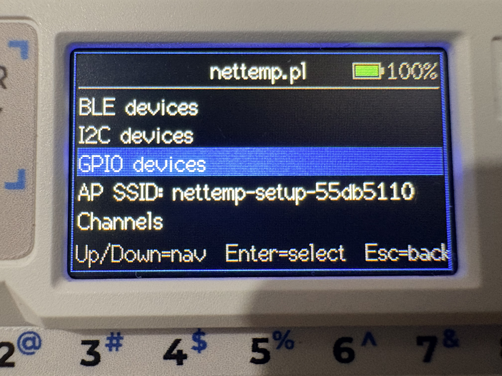
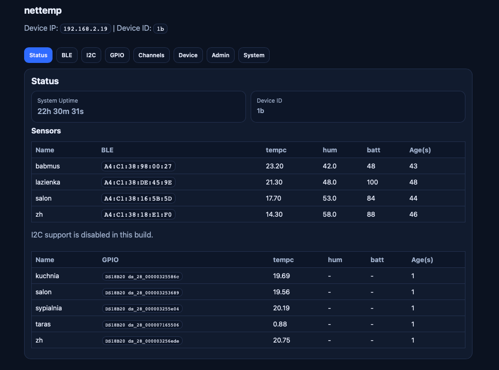

## Nettemp ESP32 (Cardputer): BLE thermometer viewer (Xiaomi LYWSD03MMC)

Status: **Fully supported** on both standard ESP32 and M5Stack Cardputer ESP32-S3.

**Note:** BLE scanning may occasionally trigger watchdog timer resets, but the device automatically recovers and continues operation.

More info: https://nettemp.pl

Arduino sketch for **any ESP32** as a Nettemp client (also works great with **M5Stack Cardputer / ESP32-S3**) that:
- scans BLE in passive/active mode and decodes **LYWSD03MMC** (ATC/PVVX advertising),
- reads I2C sensors (**BMP180**, **BMP280**, **BME280**, **TMP102**, **SHT3x**, **SHT21/HTU21D/SI7021**, **AHT10/20/21/30**, **TSL2561** light, **VL53L0X** distance),
- reads GPIO sensors like **DHT11/DHT22**, **DS18B20**, **HC-SR04** (ultrasonic), and **capacitive soil (ADC)**,
- supports **VBAT** reading and **deep sleep** (duty-cycle),
- shows readings on **Cardputer display** or **SSD1306 OLED**,
- has **captive portal + web UI** (Basic Auth) for config,
- can send data to **MQTT**, **Nettemp Cloud API**, or **Webhook (JSON)**,
- supports **OTA firmware upload** from the web UI.

### ⚠️ Hardware Recommendations

**ESP32-S3 is strongly recommended** over standard ESP32 due to memory constraints.

**Why ESP32-S3?**
- **512KB IRAM** vs standard ESP32's ~128KB
- Enables **all features simultaneously** (BLE + I2C + MQTT + Server + OTA)
- Standard ESP32 requires choosing **firmware variants** with limited feature sets

**Memory Comparison:**

| Chip | IRAM | Can Enable All Features? | Notes |
|------|------|--------------------------|-------|
| **ESP32** (D0WDQ6) | ~128KB | ❌ No | Requires feature-limited firmware variants |
| **ESP32-S3** (WROOM-1) | ~512KB | ✅ Yes | Recommended - all features work |
| **ESP32-C3** | ~400KB | ⚠️ Partial | More than ESP32, less than S3 |

**Recommended Boards:**
- **ESP32-S3-WROOM-1-N8R2** (8MB flash, 2MB PSRAM) - Best value ~$4-6
- **ESP32-S3-WROOM-1-N16R8** (16MB flash, 8MB PSRAM) - Future-proof ~$6-8
- **M5Stack Cardputer** - Premium option with display/keyboard

**Standard ESP32 Limitations:**
Due to limited IRAM (~128KB), standard ESP32 builds must disable some features:
- Variant 1: BLE + Server + Webhook (no I2C, no MQTT)
- Variant 2: BLE + I2C + MQTT (all features, tight on memory)
- Variant 3: BLE + I2C + Webhook (no MQTT)

See `make help` for available firmware variants.

### Quick start (Arduino IDE)
1. Install ESP32 boards support (Espressif).
2. Install libraries: `M5Cardputer`, `NimBLE-Arduino`, `Adafruit_GFX`, `Adafruit_SSD1306` (OLED), `PubSubClient` (optional), `OneWire` (optional), `DallasTemperature` (optional), `DHT sensor library` (optional).
3. **Optional VL53L0X distance sensor**: Install `Adafruit_VL53L0X` (recommended).
4. Board: **ESP32S3 Dev Module** (or Cardputer profile).
5. Flash `nettemp_esp32.ino`.

If you see NimBLE compile errors, make sure you installed **NimBLE-Arduino** (not the built-in ESP32 BLE lib).

### Building Firmware Binaries (Command Line)

To build firmware `.bin` files for distribution or OTA updates:

```bash
make help                      # Show all available build targets
make all                       # Build standard and cardputer
make standard-all-variants     # Build all 3 standard ESP32 variants
make cardputer                 # Build Cardputer ESP32-S3 only
make clean                     # Clean build artifacts
```

**Standard ESP32 Firmware Variants** (all include Web + OTA):
```bash
make standard-ble-server       # BLE + Server + Webhook + GPIO
make standard-ble-i2c-mqtt     # BLE + I2C + MQTT + GPIO (most features)
make standard-ble-i2c-webhook  # BLE + I2C + Server + Webhook + GPIO
```

**Requirements:**
- Install `arduino-cli`: `brew install arduino-cli` (macOS) or download from [arduino.github.io/arduino-cli](https://arduino.github.io/arduino-cli/)
- Install ESP32 boards: `arduino-cli core install esp32:esp32`
- Install required libraries via arduino-cli or Arduino IDE

**Quick Setup:**
```bash
./setup-arduino-cli.sh   # Automatically installs ESP32 core and all required libraries
```

**Output:**
Firmware binaries are saved to `firmware/` directory:
- Standard variants: `nettemp_esp32_standard_ble_*_YYYYMMDD_HHMMSS.bin` (feature-limited)
- Cardputer: `nettemp_esp32_cardputer_YYYYMMDD_HHMMSS.bin` (all features enabled)

**Flashing:**
```bash
# Standard ESP32
esptool.py write_flash 0x10000 firmware/nettemp_esp32_standard_*.bin

# Cardputer ESP32-S3
esptool.py write_flash 0x10000 firmware/nettemp_esp32_cardputer_*.bin
```

### Usage
- First boot starts an open AP + captive portal:
  - SSID: `nettemp-setup-<chipid>`
  - URL: `http://192.168.4.1/`
- After WiFi connects: open `http://<device-ip>/` (Basic Auth) to configure BLE/I2C/MQTT/Server.
- On device: `BtnA/BtnB` move, `Enter` select, `Esc` back.
- **All JSON fields are fully customizable** per transport (Server/LocalServer/MQTT/Webhook) via web UI checkboxes. You have complete control - uncheck any field to disable it, including temperature.

### Sensor ID Format Reference

All sensor IDs follow the pattern: `{deviceId}-{sensor_type}_{details}_{field}`

The `deviceId` is configurable in settings (default: `nettemp_esp32`).

**Sensor ID Formats by Type:**

| Sensor Type | Base Format | Example | Initial Field Suffixes* |
|------------|-------------|---------|-------------------------|
| **BLE** | `{deviceId}-ble_{MAC}` | `nettemp_esp32-ble_A4C138ABCDEF` | `_temp`, `_hum`, `_batt` |
| **I2C** | `{deviceId}-i2c_0x{ADDR}_{TYPE}` | `nettemp_esp32-i2c_0x76_bme280` | `_temp`, `_hum`, `_press` |
| **I2C Light** | `{deviceId}-i2c_0x{ADDR}_tsl2561` | `nettemp_esp32-i2c_0x29_tsl2561` | `_lux` |
| **I2C Distance** | `{deviceId}-i2c_0x{ADDR}_vl53l0x` | `nettemp_esp32-i2c_0x29_vl53l0x` | `_dist` |
| **DS18B20** | `{deviceId}-ds_{FAMILY}_{SERIAL}` | `nettemp_esp32-ds_28_000003253425` | `_temp` |
| **DHT** | `{deviceId}-dht{TYPE}_gpio{PIN}` | `nettemp_esp32-dht22_gpio16` | `_temp`, `_hum` |
| **VBAT** | `{deviceId}-vbat` | `nettemp_esp32-vbat` | `_batt`, `_volt` |
| **Soil** | `{deviceId}-soil_adc{PIN}` | `nettemp_esp32-soil_adc34` | `_raw`, `_pct` |
| **HC-SR04** | `{deviceId}-hcsr04_gpio{TRIG}_{ECHO}` | `nettemp_esp32-hcsr04_gpio13_14` | `_dist` |

*Initial values on first boot. **All fields are fully customizable** via web UI checkboxes - you can enable/disable any field.

**Format Details:**

- **BLE MAC**: 12 uppercase hex digits without colons (e.g., `A4C138ABCDEF`)
- **I2C Address**: Lowercase hex with `0x` prefix (e.g., `0x76`, `0x29`)
- **I2C Type**: Sensor type name (e.g., `bmp180`, `bmp280`, `bme280`, `tmp102`, `sht3x`, `sht21`, `aht10`, `tsl2561`, `vl53l0x`)
- **DS18B20 Serial**: Linux w1 format - family code + underscore + 12-char serial (lowercase hex)
- **DHT Type**: `11` or `22`
- **GPIO Pins**: Actual GPIO numbers used
- **ADC Pin**: ADC-capable pin number (e.g., `34`, `35`)

**Available Field Suffixes (all optional, configurable via web UI):**

- `_temp` / `_tempc` - Temperature in Celsius (°C)
- `_tempf` - Temperature in Fahrenheit (°F)
- `_hum` - Humidity (%)
- `_batt` - Battery percentage (%)
- `_volt` - Voltage (V)
- `_rssi` - Signal strength (dBm)
- `_press` - Pressure (hPa)
- `_lux` - Light intensity (lux) - TSL2561
- `_dist` - Distance in centimeters - HC-SR04, VL53L0X
- `_raw` - Raw ADC value (soil moisture)
- `_pct` - Percentage value (soil moisture)

### UI build selection
- Cardputer UI auto-enables when Cardputer board is detected.
- Force UI on/off with build flags:
  - `-DNETTEMP_CARDPUTER_UI=1` (uses built-in ST7789 LCD)
  - `-DNETTEMP_CARDPUTER_UI=0` (standard ESP32 with optional SSD1306 OLED)

**Build variants:**
- **Standard ESP32**: OLED (SSD1306) enabled by default, Cardputer UI disabled
- **Cardputer ESP32-S3**: OLED disabled (uses built-in ST7789 LCD), Cardputer UI enabled

### Compile-time toggles (size/features)
In `nettemp_esp32.ino`:
- `NETTEMP_ENABLE_SERVER` (HTTP/HTTPS to Cloud)
- `NETTEMP_ENABLE_MQTT`
- `NETTEMP_ENABLE_I2C`
- `NETTEMP_ENABLE_OLED`
- `NETTEMP_ENABLE_PORTAL` (web UI + OTA)

If the sketch is too big, switch to **Huge APP (3MB No OTA)** partition scheme (note: OTA upload needs a partition scheme with OTA).

### BLE notes
- This sketch decodes **advertising payloads** (ATC/PVVX).
- Stock Xiaomi firmware “active mode” (GATT read) needs bindkeys and a different implementation.
- To parse manufacturer data (more noise), set `#define NETTEMP_BLE_PARSE_MFG 1`.

### Cloud send (default)
Endpoint: `https://api.nettemp.pl/api/v1/data`  
Auth: `Authorization: Bearer ntk_...`

### Troubleshooting
- `esp_bt.h: No such file or directory` → wrong board/core; install **esp32 by Espressif Systems**.
- BLE sees nothing → try `ble active`, ensure you flashed this repo version.
- `util/delay.h: No such file` (Adafruit_SSD1306 compile error) → Update Adafruit_SSD1306 library to latest version:
  ```bash
  arduino-cli lib upgrade "Adafruit SSD1306"
  # Or run the setup script: ./setup-arduino-cli.sh
  ```

### Code layout
- `nettemp_esp32.ino` (main)
- `nettemp_core.inc`, `nettemp_web.inc`, `nettemp_power.inc`

---
